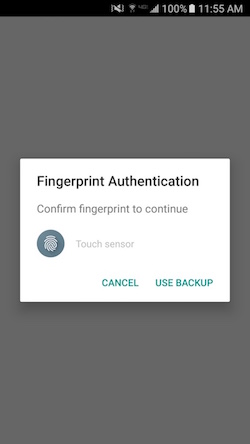
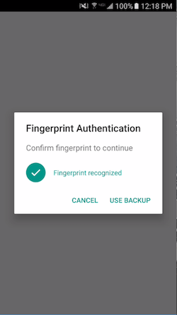
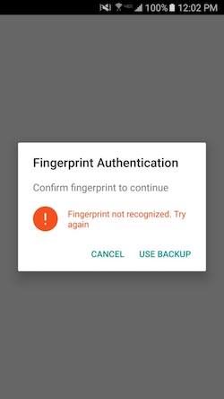
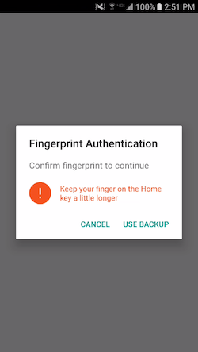
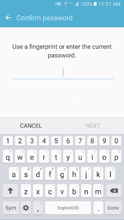
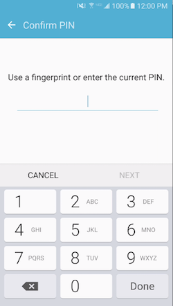
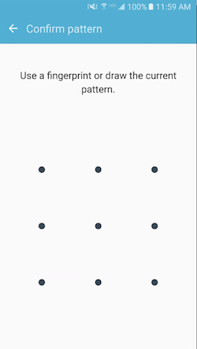

# Update to Version 1.4.0
Please consult the [changelog](https://github.com/mjwheatley/cordova-plugin-android-fingerprint-auth/blob/master/changelog.md).

# About
This plugin was created referencing the [Fingerprint Dialog sample](http://developer.android.com/samples/FingerprintDialog/index.html) and the [Confirm Credential sample](http://developer.android.com/samples/ConfirmCredential/index.html) referenced by the [Android 6.0 APIs webpage](http://developer.android.com/about/versions/marshmallow/android-6.0.html).

This plugin will open a native dialog fragment prompting the user to authenticate using their fingerprint.  If the device has a secure lockscreen (pattern, PIN, or password), the user may opt to authenticate using that method as a backup.

This plugin will only work on devices whose manufacturers have implemented the Android 6.0 Fingerprint Authentication API.  This plugin does not support the Samsung Pass SDK and not all Samsung devices implement the Android 6.0 Fingerprint Authentication API.  If you are testing this plugin on a Samsung device and it is not working, please check the device compatibility before reporting an issue.

# Screenshots
### Fingerprint Authentication Dialog
     
### Backup Credentials
  

# Installation
### Cordova
`cordova plugin add cordova-plugin-android-fingerprint-auth`

### Ionic
`ionic cordova plugin add cordova-plugin-android-fingerprint-auth`

### Meteor
`meteor add cordova:cordova-plugin-android-fingerprint-auth@1.2.7 (or present version)`

# How to use
- Call `isAvailable()` to check the fingerprint status.
- Call `encrypt()` or `decrypt()` show the Authentication Dialog.
- Call `delete()` when you want to delete the cipher for the user.

If you are not concerned with encrypting credentials and just want device authentication (fingerprint or backup), just call `encrypt()` with a `clientId` and look for a callback to the `successCallback`.

### Encrypt/Decrypt User Credentials
 
* Encrypt user credentials
    * Have user sign in with username and password.
    * Check plugin availability and pass username and password to `encrypt()`.
    * Store encrypted token with user profile.
* Decrypt user credentials
    * Prompt for username.
    * Query on username to retrieve encrypted token.
    * Pass username and token to `decrypt()` to return password.
    * Login using username and decrypted password.

### Example implementation
* I have created an example implementation using Angular2-Meteor and Ionic2 ([ionic2-meteor-login-fingerprint](https://github.com/mjwheatley/ionic2-meteor-login-fingerprint)).
    * See ["How It Works"!](https://github.com/mjwheatley/ionic2-meteor-login-fingerprint#how_it_works)


# API Reference
* FingerprintAuth
    * [isAvailable(isAvailableSuccess, isAvailableError)](#module_fingerprintauth.isAvailable)
    * [encrypt(encryptConfig, successCallback, errorCallback)](#module_fingerprintauth.encrypt)
    * [decrypt(decryptConfig, successCallback, errorCallback)](#module_fingerprintauth.decrypt)  
    * [delete(deleteConfg, successCallback, errorCallback)](#module_fingerprintauth.delete)
    * [dismiss(successCallback, errorCallback)](#module_fingerprintauth.dismiss)
    * [ERRORS](#module_fingerprintauth.errors)
* [Config Object](#module_fingerprintauth.config)

<a name="module_fingerprintauth.isAvailable"></a>

# FingerprintAuth.isAvailable(successCallback, errorCallback)

Opens a native dialog fragment to use the device hardware fingerprint scanner to authenticate against fingerprints
registered for the device.

### isAvailable() Result Object
| Param | Type  | Description |
| --- | --- | ---  |
| isAvailable | boolean | Fingerprint Authentication Dialog is available for use. |
| isHardwareDetected | boolean | Device has hardware fingerprint sensor. |
| hasEnrolledFingerprints | boolean | Device has any fingerprints enrolled. |

**Example**

```javascript
FingerprintAuth.isAvailable(isAvailableSuccess, isAvailableError);

/**
 * @return {
 *      isAvailable:boolean,
 *      isHardwareDetected:boolean,
 *      hasEnrolledFingerprints:boolean
 *   }
 */
function isAvailableSuccess(result) {
    console.log("FingerprintAuth available: " + JSON.stringify(result));
    if (result.isAvailable) {
        var encryptConfig = {}; // See config object for required parameters
        FingerprintAuth.encrypt(encryptConfig, encryptSuccessCallback, encryptErrorCallback);
    }
}

function isAvailableError(message) {
    console.log("isAvailableError(): " + message);
}
```

<a name="module_fingerprintauth.config"></a>

### FingerprintAuth Config Object

| Param | Type | Default | Description |
| --- | --- | --- | --- |
| clientId | String | undefined | (**REQUIRED**) Used as the alias for your app's secret key in the Android Key Store. Also used as part of the Shared Preferences key for the cipher userd to encrypt the user credentials. |
| username | String | undefined | Used to create credential string for encrypted token and as alias to retrieve the cipher. |
| password | String | undefined |  Used to create credential string for encrypted token |
| token | String | undefined | Data to be decrypted. ***Required*** for `decrypt()`. |
| disableBackup | boolean | false | Set to true to remove the "USE BACKUP" button |
| maxAttempts | number | 5 | The device max is 5 attempts.  Set this parameter if you want to allow fewer than 5 attempts.  |
| locale | String | "en_US" | Change the language displayed on the authentication dialog.<br/><ul><li>English: "en_US"</li><li>Italian: "it"</li><li>Spanish: "es"</li><li>Russian: "ru"</li><li>French: "fr"</li><li>Chinese (Simplified): <ul><li>"zh_CN"</li><li>"zh_SG"</li></ul></li><li>Chinese (Traditional): <ul><li>"zh"</li><li>"zh_HK"</li><li>"zh_TW"</li><li>"zh_MO"</li></ul></li><li>Norwegian: "no"</li><li>Portuguese: "pt"</li><li>Japanese: "ja"</li><li>German: "de"</li><li>Thai: "th"</li><li>Arabic: "ar"</li><li>Korean: "ko", "ko-KR"</li></ul> |
| userAuthRequired | boolean | false | Require the user to authenticate with a fingerprint to authorize every use of the key.  New fingerprint enrollment will invalidate key and require backup authenticate to re-enable the fingerprint authentication dialog. |
| encryptNoAuth | boolean | undefined | Bypass authentication and just encrypt input.  If `true` this option will not display the authentication dialog for fingerprint or backup credentials.  It will just encrypt the input and return a token. |
| dialogTitle | String | undefined | Set the title of the fingerprint authentication dialog. |
| dialogMessage | String | undefined | Set the message of the fingerprint authentication dialog. |
| dialogHint | String | undefined | Set the hint displayed by the fingerprint icon on the fingerprint authentication dialog. |


<a name="module_fingerprintauth.encrypt"></a>

# FingerprintAuth.encrypt(encryptConfig, encryptSuccessCallback, encryptErrorCallback)

### Result Object
| Param | Type  | Description |
| --- | --- | ---  |
| withFingerprint | boolean | User authenticated using a fingerprint |
| withBackup | boolean | User authenticated using backup credentials. |
| token | String | Will contain the base64 encoded credentials upon successful fingerprint authentication. |

**Example**  

```javascript
var encryptConfig = {
    clientId: "myAppName",
    username: "currentUser",
    password: "currentUserPassword"
};


FingerprintAuth.encrypt(encryptConfig, successCallback, errorCallback);

function successCallback(result) {
    console.log("successCallback(): " + JSON.stringify(result));
    if (result.withFingerprint) {
        console.log("Successfully encrypted credentials.");
        console.log("Encrypted credentials: " + result.token);  
    } else if (result.withBackup) {
        console.log("Authenticated with backup password");
    }
}

function errorCallback(error) {
    if (error === FingerprintAuth.ERRORS.FINGERPRINT_CANCELLED) {
        console.log("FingerprintAuth Dialog Cancelled!");
    } else {
        console.log("FingerprintAuth Error: " + error);
    }
}

```

<a name="module_fingerprintauth.decrypt"></a>

# FingerprintAuth.decrypt(decryptConfig, encryptSuccessCallback, encryptErrorCallback)

### Result Object
| Param | Type  | Description |
| --- | --- | ---  |
| withFingerprint | boolean | User authenticated using a fingerprint |
| withBackup | boolean | User authenticated using  backup credentials. |
| password | String | Will contain the decrypted password upon successful fingerprint authentication.

**Example**  

```javascript
var decryptConfig = {
    clientId: "myAppName",
    username: "currentUser",
    token: "base64encodedUserCredentials"
};

FingerprintAuth.decrypt(decryptConfig, successCallback, errorCallback);

function successCallback(result) {
    console.log("successCallback(): " + JSON.stringify(result));
    if (result.withFingerprint) {
        console.log("Successful biometric authentication.");
        if (result.password) {
            console.log("Successfully decrypted credential token.");
            console.log("password: " + result.password);  
        }
    } else if (result.withBackup) {
        console.log("Authenticated with backup password");
    }
}

function errorCallback(error) {
    if (error === FingerprintAuth.ERRORS.FINGERPRINT_CANCELLED) {
        console.log("FingerprintAuth Dialog Cancelled!");
    } else {
        console.log("FingerprintAuth Error: " + error);
    }
}

```

<a name="module_fingerprintauth.delete"></a>

# FingerprintAuth.delete(config, successCallback, errorCallback)

Used to delete a cipher.

#### Config Object
| Param | Type | Default | Description |
| --- | --- | --- | --- |
| clientId | String | undefined | (REQUIRED) Used as the alias for your key in the Android Key Store. |
| username | String | undefined | Identify which cipher to delete. |

**Example**

```javascript
FingerprintAuth.delete({
            clientId: "myAppName",
            username: "usernameToDelete"
        }, successCallback, errorCallback);

function successCallback(result) {
    console.log("Successfully deleted cipher: " + JSON.stringify(result));
}

function errorCallback(error) {
    console.log(error);
}
```

<a name="module_fingerprintauth.dismiss"></a>

# FingerprintAuth.dismiss(successCallback, errorCallback)

Used to dismiss a Fingerprint Authentication Dialog if one is being displayed

**Example**

```javascript
FingerprintAuth.dismiss(successCallback, errorCallback);

function successCallback(result) {
    console.log("Successfully dismissed FingerprintAuth dialog: " + JSON.stringify(result));
}

function errorCallback(error) {
    console.log(error);
}
```


<a name="module_fingerprintauth.errors"></a>

# FingerprintAuth.ERRORS `JSON Object`
| Property | Type | Value |
| --- | --- | --- |
| BAD_PADDING_EXCEPTION | String | "BAD_PADDING_EXCEPTION" |
| CERTIFICATE_EXCEPTION | String | "BAD_PADDING_EXCEPTION" |
| FINGERPRINT_CANCELLED | String | "FINGERPRINT_CANCELLED" |
| FINGERPRINT_DATA_NOT_DELETED | String | "FINGERPRINT_DATA_NOT_DELETED" |
| FINGERPRINT_ERROR | String | "FINGERPRINT_ERROR" |
| FINGERPRINT_NOT_AVAILABLE | String | "FINGERPRINT_NOT_AVAILABLE" |
| FINGERPRINT_PERMISSION_DENIED | String | "FINGERPRINT_PERMISSION_DENIED" |
| FINGERPRINT_PERMISSION_DENIED_SHOW_REQUEST | String | "FINGERPRINT_PERMISSION_DENIED_SHOW_REQUEST" |
| ILLEGAL_BLOCK_SIZE_EXCEPTION | String | "ILLEGAL_BLOCK_SIZE_EXCEPTION" |
| INIT_CIPHER_FAILED | String | "INIT_CIPHER_FAILED" |
| INVALID_ALGORITHM_PARAMETER_EXCEPTION | String | "INVALID_ALGORITHM_PARAMETER_EXCEPTION" |
| IO_EXCEPTION | String | "IO_EXCEPTION" |
| JSON_EXCEPTION | String | "JSON_EXCEPTION" |
| MINIMUM_SDK | String | "MINIMUM_SDK" |
| MISSING_ACTION_PARAMETERS | String | "MISSING_ACTION_PARAMETERS" |
| MISSING_PARAMETERS | String | "MISSING_PARAMETERS" |
| NO_SUCH_ALGORITHM_EXCEPTION | String | "NO_SUCH_ALGORITHM_EXCEPTION" |
| SECURITY_EXCEPTION | String | "SECURITY_EXCEPTION" |
| FRAGMENT_NOT_EXIST | String | "FRAGMENT_NOT_EXIST |
